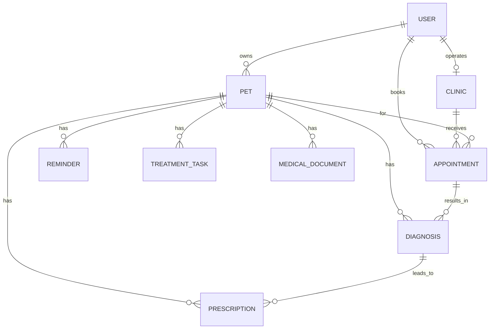

# ERD (Logical)

```mermaid
erDiagram
  USER ||--o{ PET : owns
  USER ||--o| CLINIC : operates
  USER ||--o{ APPOINTMENT : books
  CLINIC ||--o{ APPOINTMENT : receives
  PET ||--o{ APPOINTMENT : for
  PET ||--o{ DIAGNOSIS : has
  PET ||--o{ PRESCRIPTION : has
  PET ||--o{ REMINDER : has
  PET ||--o{ TREATMENT_TASK : has
  PET ||--o{ MEDICAL_DOCUMENT : has
  APPOINTMENT ||--o{ DIAGNOSIS : results_in
  DIAGNOSIS ||--o{ PRESCRIPTION : leads_to
```
